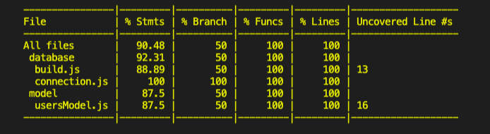
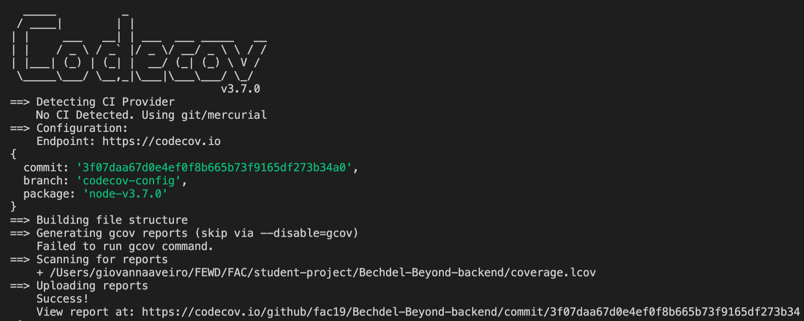

<!-- omit in toc -->
# Codecov with Jest/React 

**Content**
- [Setup with Jest in React](#setup-with-jest-in-react)
  - [Generating reports and "react-scripts test"](#generating-reports-and-react-scripts-test)
  - [Uploading the report](#uploading-the-report)
    - [Not using CI](#not-using-ci)
    - [Using CI (Travis)](#using-ci-travis)
- [Extras](#extras)
- [Resources](#resources)


In a nutshell, [Codecov.io](http://codecov.io) is a tool that integrates code coverage reports making it easy to identify what areas of your code are or are not being tested. It is supported by [lots of languages](https://docs.codecov.io/docs/supported-languages), Javascript/Node.js included. The set up however also varies according to what test runner you are using in your project. For our project Bechdel and Beyond we decided to use Tape in the [backend](https://github.com/fac19/Bechdel-Beyond-backend) and Jest in React for the [front-end](https://github.com/fac19/Bechdel-Beyond). Below I am sharing the steps we took to set up our front-end repo in Codecov.

# Setup with Jest in React

If using **Jest** in a React app you won't need extra tools to implement test coverage. **Jest** already comes with Istanbul library to generate coverage reports, so there is no need to install `nyc` like we have to do with Tape. In this case, I didn't find the instructions provided by Codecov useful. Instead, Jest says on their homepage that you only need to add `--coverage` flag to "generate coverage". 

However, it wasn't clear to me that "generate coverage" doesn't include uploading the report to codecov, if the watch mode would interfere  the reporting, and, being a newbie in React, I also was wondering if I had to change the React default script `"test": "react-scripts test"` to Jest. 

## Generating reports and "react-scripts test"

Is an out of the box React App script that uses Jest as test runner. When invoked, it runs Jest in watch mode. Another important distinction is that `react-script test` already comes with [Babel](https://babeljs.io/docs/en/index.html), so unlike pure Jest it is able to read `jsx` code. Therefore, changing the test script to Jest, makes it necessary to install babel for your tests to run.

In our project, I decided to add a new script to run tests when generating coverage report turning watch mode to false:

```
"scripts": {
		"test": "react-scripts test",
		"test:report": "react-scripts test --coverage --watchAll=false && codecov"
	}, 
```

[React instructions](https://create-react-app.dev/docs/running-tests/#coverage-reporting) suggests to simply add `—- —-coverage` to the default test script. This works just as fine if you prefer to use the test script generated by react. If creating a different one, the double dash isn't needed. This is because the out-of-the-box `test` script calls the  `react-scripts test` and if you want to pass any extra argument to it, then the double dash is required for it to run in a customised way. However, if you create a custom command like I did, you are already creating a script with what you want.

Running `npm run test:report`   will then show the report below alongside your tests and will generate a coverage folder with the report all entirely locally.



If you don't see all your files on the list or you see anything that shouldn't be included in the converage, you can include a jest config section in your package.json. The examples below might be useful, but a full list of Jest coverage config options can be found [here](https://jestjs.io/docs/en/configuration).

```json
"jest": {
	"coveragePathIgnorePatterns": [
		"<rootDir>/src/serviceWorker.js"
	]
}
```

```json
"jest": {
	"collectCoverageFrom": [
		"**/*.js",
		"!node_modules/**",
		"!coverage/**"
		]
}
```

## Uploading the report

Finally, the  `&& codecov` part is responsible for uploading the report to [Codecov.io](http://codecov.io). For this to work, just install `npm i codecov` in development dependencies. 

To test if you can send a report to Codecov, register to [codecov.io](http://codecov.io) with the account where your repo lives and add the token provided at the end of the script above `-t <token>`

When running your script (assuming you have tests in your project) you should see the below in your terminal:



Important! The report will be uploaded to codecov.io only after pushing your branch to the remote. 

Don't forget to include /coverage to the `.gitignore`

```
/coverage
```

### Not using CI

If you are not using any CI yet, remove the token and `-t` from your package.json and save the token in a `.env` file. Push your branch to the remote and the report will be uploaded to your Codecov dashboard. It might take it some seconds to upload.

### Using CI (Travis)

If using Travis in your project, remove the token and `-t` from your package.json and save the token provided in your project dashboard on Travis. Add both scripts to your `.travis.yml`:

```
script:
  - npm run test
  - npm run report:test
```

And that is it 😉

# Extras

Now that you have done all of this, go to your project dashboard in [codecov.io](http://code.io) > settings > badge and add a coverage badge to share your amazing code coverage in your readme! 

# Resources

Good article about JavaScript testing frameworks: [An Overview of JavaScript Testing in 2020](https://medium.com/welldone-software/an-overview-of-javascript-testing-7ce7298b9870).

[Stackoverflow about React test scrip and Jest/babel.](https://stackoverflow.com/questions/53322632/using-jest-vs-react-scripts-test)

[More about running tests in React.](https://create-react-app.dev/docs/running-tests/)

---

Inputs, comments and suggestions always welcome!</br>
[@glrta](https://github.com/glrta)</br>
to.gio@pm.me