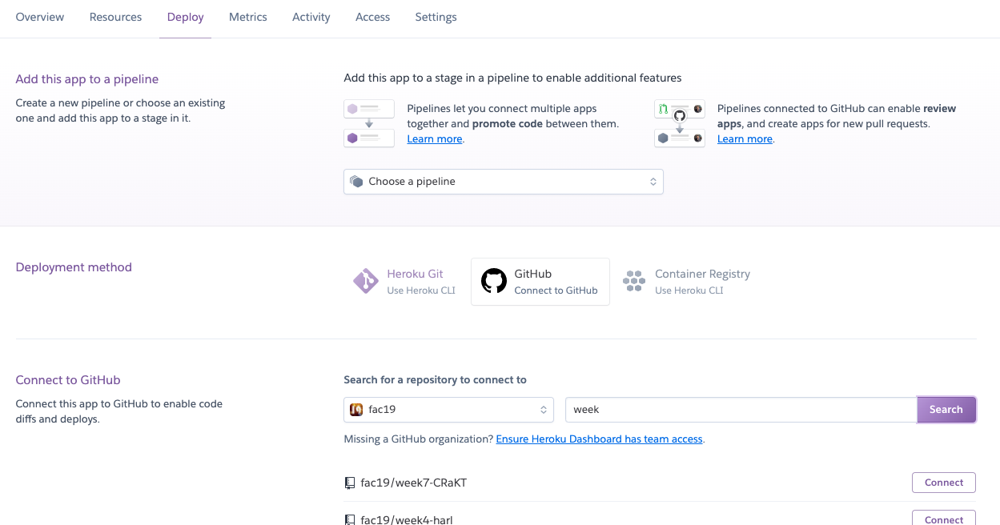
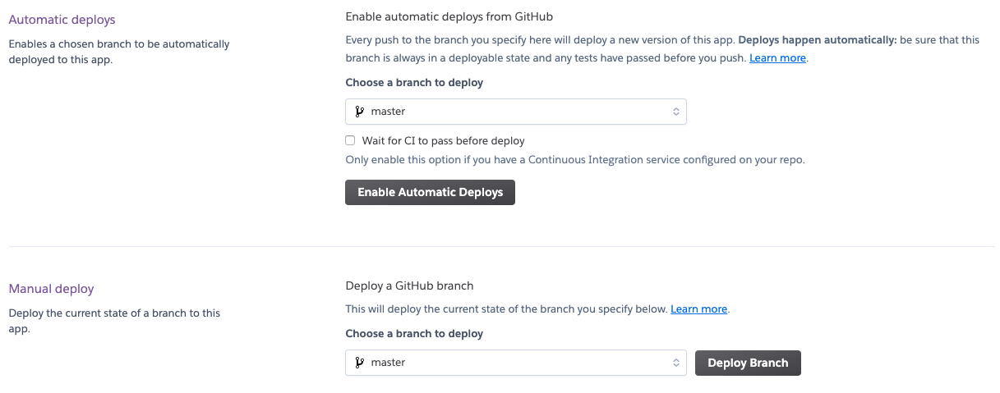
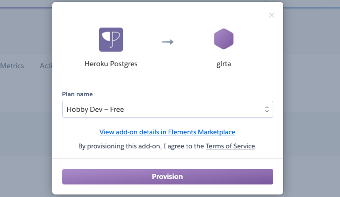
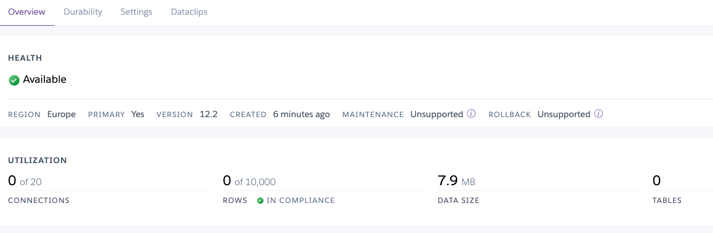

<!-- omit in toc -->
# Deploy to Heroku: beginners guide

**Content**
- [**Deploy to Heroku**](#deploy-to-heroku)
- [**Deploying your database to Heroku**](#deploying-your-database-to-heroku)
  - [**Connect to database**](#connect-to-database)
- [Other stuff](#other-stuff)
- [Resources](#resources)


## Deploy to Heroku

Signup/Login to [www.heroku.com](http://www.heroku.com). Go to `New` > `Create new app` to start. Add name, region and hit `Create app`. Choose GitHub as deployment method under 'Deploy' tab, search for your repo to connect: 



Enable automatic deploys with master branch still under Deploy tab and hit `Deploy Branch` in 'Manual deploy' to deploy your app:



---

Important to notice that after deployment Heroku will run what is in script 'start' in your package.json to start your application. Make sure it is correct.

```
"script": {
	"start": "server.js"
}
```

## Deploying your database to Heroku

Once your app is up you should see the message below:


Go to 'Resources' tab and search for `Heroku Postgres` add-on, then select the `Hobby Dev - Free` version and hit `Provision` to confirm.



Back to 'Resources' tab you can see your current database clicking on `Heroku Postgres`. You should see in a new tab something similar to the below image, indicating your database is empty:



### Connect to database

Heroku will generate a DATABASE_URL that you will need to use to connect to your production database. You can find this under 'Settings' back to the project tab in `Reveal Config Vars` with key 'DATABASE_URL'. 

Important: If your project/database depend on API keys or tokens, add them in your `config vars`.

There are two ways to connect to it:

1.  One method is connecting directly via psql/pgcli copying and pasting the url in your terminal 

```sql
//in psql

\c <DATABASE_URL>;
\i database/init.sql;
```

2. Second method: establish connection programmatically via adding `PGDATABASE='<DATABASE_URL>'` as your environment variable instead of your local database. 

```
///.env

PGDATABASE=yourlocaldatabase
PGUSER=myuser
PGPASSWORD=mypassword
```

# Other stuff

- view more info about database by accessing it from 'Resources' and navigating to 'Settings' > `View Credentials`.
- add collaborators via `Access`tab,
- view logs in `More`.
- You can delete projects from Heroku in 'Setting' at the bottom of the page.
- If run into problems, if might be helpful to login to your project on Heroku via CLI. Install Heroku  (macOS) to access it : `brew tap heroku/brew && brew install heroku`. To login: `heroku login` (credentials required). More about [Heroku CLI](https://devcenter.heroku.com/articles/heroku-cli-commands).

# Resources

[Heroku Spike](https://github.com/fac19/research/blob/master/week4/heroku.md)

---

Inputs, comments and suggestions always welcome!</br>
[@glrta](https://github.com/glrta)</br>
to.gio@pm.me